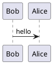

# Home

## 2ndレベルのタイトルです
- 本文本文本文本文本文本文本文本文本文本文本文本文本文本文本文本文本文本文本文本文本文本文本文本文本文本文本文本文本文本文本文本文本文本文本文本文本文本文本文本文本文本文本文本文本文本文本文本

### 3rdレベルのタイトルです
- 本文本文本文本文本文本文本文本文本文本文本文本文本文本文本文本文本文本文本文本文本文本文本文本文本文本文本文本文本文本文本文本文本文本文本文本文本文本文本文本文本文本文本文本文本文本文本文本文本文本文本文本文本文本文本文本文本文本文本文本文
- 本文本文本文本文本文本文本文本文本文本文本文本文本文本文本文本文本文本文本文本文本文本文本文本文本文本文本文本文本文本文本文本文本文本文本文本文本文本文本文本文
- 本文本文本文本文本文本文本文本文本文本文本文本文本文本文本文本文本文本文本文本文本文本文本文本文本文本文本文本文本文本文本文本文本文本文本文本文本文本文本文本文

#### 4thレベルのタイトルです
- 本文本文本文本文本文本文本文本文本文本文本文本文本文本文本文本文本文本文本文本文本文本文本文本文本文本文本文本文本文本文本文本文本文本文本文本文本文本文本文本文本文本文本文本文本文本文本文本文本文本文
- 本文本文本文本文本文本文本文本文本文本文本文本文本文本文本文本文本文本文本文本文本文本文本文本文本文本文本文本文本文本文
- 本文本文本文本文本文本文本文本文本文本文本文本文本文本文本文本文本文本文本文本文本文本文本文本文本文本文本文本文本文本文

##### 5thレベルのタイトルです
- 本文本文本文本文本文本文本文本文本文本文本文本文本文本文本文本文本文本文本文本文
- 本文本文本文本文本文本文本文本文本文本文本文本文本文本文本文本文本文本文本文本文本文本文本文本文本文本文本文本文本文本文本文本文本文本文本文本文本文本文本文本文本文本文本文本文本文本文本文本文本文本文
- 本文本文本文本文本文本文本文本文本文本文本文本文本文本文本文本文本文本文本文本文本文本文本文本文本文本文本文本文本文本文

### PlantUML のサンプルです


### ソースコードハイライト のサンプルです
```c#
// Program.cs
static void Main(string[] args)
{
    var startingDeck = from s in Suits()
                       from r in Ranks()
                       select new { Suit = s, Rank = r };

    // Display each card that we've generated and placed in startingDeck in the console
    foreach (var card in startingDeck)
    {
        Console.WriteLine(card);
    }
}
```

### 表のサンプルです

| 項目001 |  項目002  |
| ---- | ---- |
| サンプルサンプルサンプル | サンプルサンプル |
| サンプル | サンプルサンプルサンプルサンプルサンプル |

